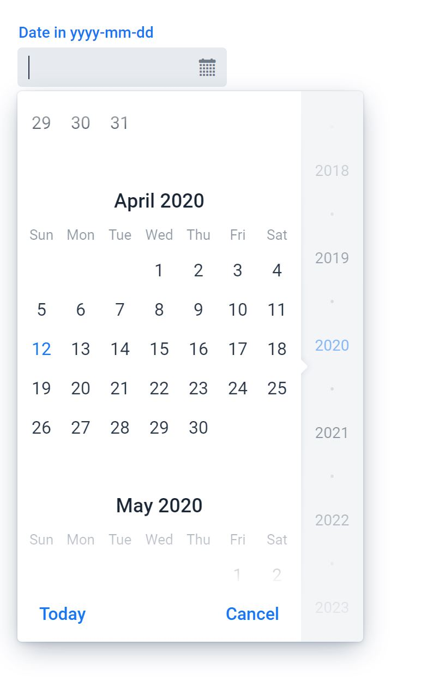

Decrypstocks

Our project is a web based application. It uses maven java project structure for deploying the site on a local host machine.

To get the project started:
You must have IntelliJ IDEA or any other IDE with maven support that can run a JVM

This is a run through of our project through IntelliJ IDEA.

1) Import the Porject:
    Press import -> Browse to local folder where project is stored and select the program
    NOTE: Select the maven_application folder

2) Import with Maven settings

3) You will be brought to the project view: 

4) To run the program you must follow the instructions:
    Press Run -> Edit Configurations
    Change Command line argument to ->jetty:run
    Press OK

5) The server will take some time to load approximately 10 min if it does not crash.
    Your window will look the the following once it is done.
    If this does not work skip to step 11.

6) You can now access the program through your web browser.
    Link-> localhost:8080

7) Select the date and the arguments to your desire:

8) Press Search once your arguments are input. It will take some time as it runs through the data set to find stocks that match your arguments.
    Once the program runs you will obtain a table with the stocks that fit your requirments.
    NOTE: If you press search without arguments the program will not run. Also wrong inputs will not make the program run.

9) Once the program runs you will obtain a table with the stocks that fit your requirments.
    NOTE: If you press search without arguments the program will not run. Also wrong inputs will not make the program run.

10) If you want to search stocks similarly priced to a certain stock, type the name from the stock table.
    Press Search Price
    NOTE: Wrong input will not show the new table.

11) Decrypstocks also functions through the command line if the server will not load. Simply type 'make' followed by 'make expt' to access the application. If this does not work
    simply run src/Main.java in Eclipse or another IDE.